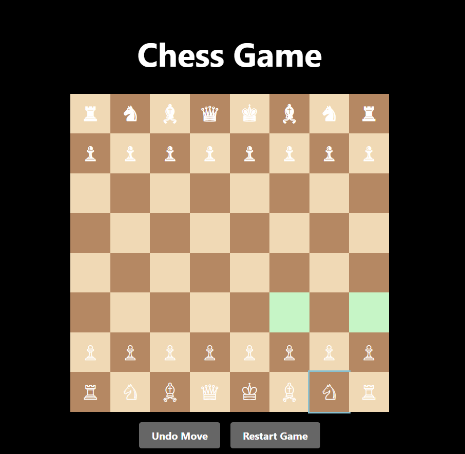

#Chess Game — React + TypeScript

A simple chess game built with **React**, **TypeScript**, and **chess.js** that allows a player to play as white against a random AI opponent. The board includes basic move highlighting, undo functionality, restart option, and game over messages.

##  Features

-  Play as White vs AI (random moves)
- Legal move highlighting (in soft green)
- Undo your last move (AI + player)
-  Restart the game
-  Supports pawn promotion to queen
- Game Over messages for:
  - Checkmate
  - Draw
  - Stalemate

## 🛠️ Tech Stack

- **React 18+**
- **TypeScript**
- **chess.js**
- **CSS** for styling

## 📸 UI Preview



> Board is centered, responsive, and styled with dark and green themes.

## 📦 Installation

```bash
git clone https://github.com/YOUR_USERNAME/chess-game-react.git
cd chess-game-react
npm install
npm run dev
